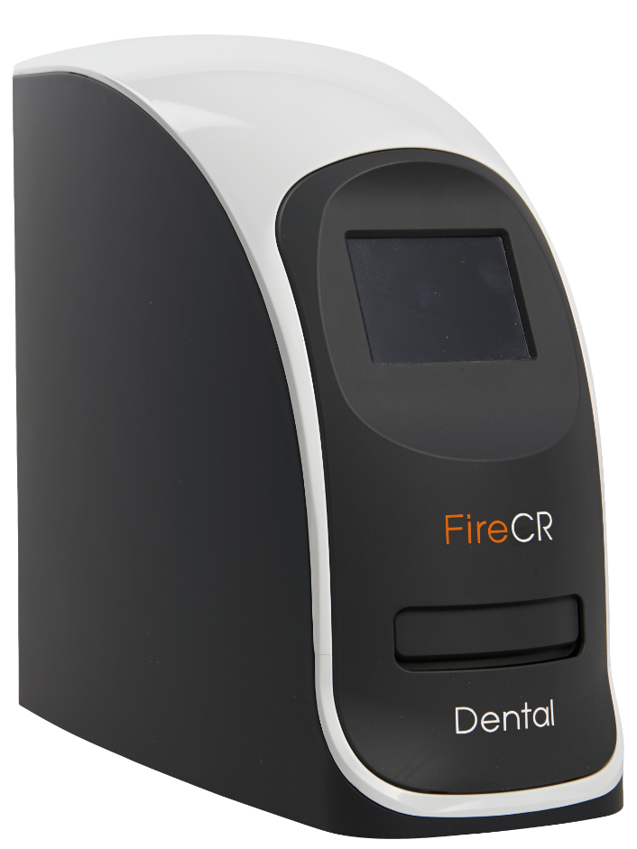

# FireCR-Dental-hacking
 Hacking the DigiRay/3DISC FireCR scanner for fun

 

The device is run by a STM32F427IIT6-CPU [datasheet](STM32F427IIT6.pdf)

Interfacing is done with a color LCD touchscreen on the front. Here you can adjust settings for scanning quality, network settings and see a preview of the scan.

The scanning of the PSP Imaging plate is done by an Altera EP4CE15E22C8N Cyclone IV-FPGA which interfaces to the STM32 CPU over some kind of parallel interface.

The main graphical resources is held on MicroSD-card and scans are also saved to SD-card, as well as streamed over Ethernet to the controlling application.

The main application comes with a DentalCR_SystemUpdater_1.1.2.exe that can update the target STM32/FPGA/Graphics etc. The unpacked data from the .exe is found in this repository.

The STM32 is not code protected and firmware (bootloader + main application) was dumped with STM32CubeProgrammer and ST-Link-V2 clone. This is FLASH.bin in the /Firmware-dump-folder.

Here's a rough overview of the different modules & circuit boards in the machine:
 

When using the machine, the exposed image plate (IP) is placed in the extending drawer in the front of the machine. The machine reads a RFID-tag stuck on the back of the IP.
A combination of the UID and the data blocks tells the machine what size the IP is and some production date (serial/date of manufacture) etc.

The RFID tag is readable with a Proxmark3 device and can be flashed onto a "Magic" card with changeable UID, as using a generic Icode SLIX RFID card will not work. It has to have the correct UID to work. This is used as a kind of Vendor lock-in we believe.
There is 28 data-blocks on the RFID card, where only the first 4 is used. Data in these blocks does not carry any resemblance to the data the machine shows or the UID, so maybe it's encrypted (xor) or similar. Can we reverse-engineer this?

The machine has different sizes of IPs it will recognise and scan. We have imaging plates size 0, 2, 3 and 4. Size 4 is physically too large to fit in the machine, but it still recognises it. Trying to scan it will abort the scan after a moment. There's an intermediary size called 4c, which is the largest the machine will scan. Can we deduct from the RFID dumps and firmware how a 4c plate will need to be coded to be recognised? These plates are expensive and as we already have a handful of Size 4 available, if it was possible to cut the to the smaller 4c size and trick the machine into scanning them, that would be kind of cool.

Here's a document that describes the data on the RFID tags we have at our disposal: [link](https://docs.google.com/spreadsheets/d/1aVb626r9JBMXpx-VkAXOxXye-787FME-MILazqtd8uc/edit?usp=sharing)
