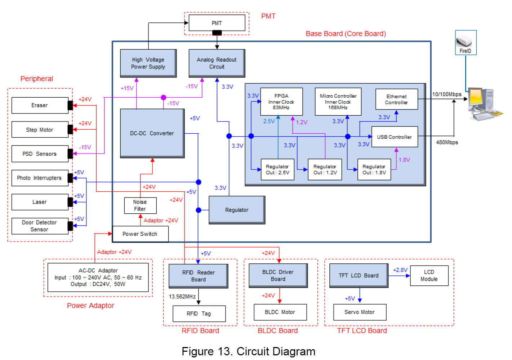

# FireCR-Dental-hacking
 Hacking the DigiRay/3DISC FireCR scanner for fun (not for profit)

 

The device is run by a STM32F427IIT6-CPU [datasheet](STM32F427IIT6.pdf)

Interfacing is done with a color LCD touchscreen on the front. Here you can adjust settings for scanning quality, network settings and see a preview of the scan.

The scanning of the PSP Imaging plate is done by an Altera EP4CE15E22C8N Cyclone IV-FPGA which interfaces to the STM32 CPU over some kind of parallel interface.

The main graphical resources is held on a 16GB MicroSD-card and scans are also saved to SD-card, as well as streamed over Ethernet and USB to the controlling application. The contents of the MicroSD has been dumped with dd and trimmed down to ~2GB after removing unused space in the file (the device never stores anything past 2GB) - The card does not have a known file system but is rather adressed as a raw flash memory device. The dd-dump can be downloaded [here](https://www.dropbox.com/scl/fi/fp8epq7omoyqgh0zt19y5/image-small.dd?rlkey=qb6tj756gdrcuu5y8aymbw7fi&dl=0)

The main PC-application ships with a DentalCR_SystemUpdater_1.1.2.exe that can update the target STM32/FPGA/Graphics etc. in case it needs an upgrade. The unpacked data from the .exe is found in this repository.

The STM32 is not code protected and firmware (bootloader + main application) was dumped with STM32CubeProgrammer and ST-Link-V2 clone. This is the FLASH.bin in the /Firmware-dump-folder.

Here's a rough overview of the different modules & circuit boards in the machine:
 

To use the machine, the exposed image plate (IP) is placed in the extending drawer in the front of the machine. The machine reads a RFID-tag stuck on the back of the IP.
A combination of the UID and the data blocks tells the machine what size the IP is and some production date (serial number/date of manufacture) etc.

The RFID tag is readable with a Proxmark3 device and can be flashed onto a [Magic](https://lab401.com/products/icode-sli-slix-compatible-uid-modifiable) card with changeable UID, as using a generic Icode SLIX RFID card will not work. It has to have the correct UID to work. This is used as a kind of Vendor lock-in we believe.
There is 28 data-blocks on the RFID card, where only the first 4 is used. Data in these blocks does not carry any resemblance to the data the machine shows or the UID, so maybe it's encrypted (xor) or similar. Can we reverse-engineer this? Seaching for xor functions in Ghidra found no use of xor, also the encryption functions in the chip seems to be unused.

The communication between the main STM32 CPU and the RFID reader (comprised of Atmel MCU + RFID chipset) talks over standard 115200 8N1 UART. The communication between them has been dumped when reading a size 2 IP and can be downloaded as a Saleae Logic file [here](Saleae_logic/RFID-reader_sees_a_tag.sal) and has been compiled into a chart [here](https://docs.google.com/spreadsheets/d/1uhhB410jKlqd6RmbbbSwVyCAjqNO0S2FCVilpBbFio0/edit?usp=sharing)

The machine has different sizes of IPs it will recognise and scan. We have imaging plates size 0, 2, 3 and 4. Size 4 is physically too large to fit in the machine, but it still recognises it and says "Size 4" on the display. Trying to scan it will abort the scan after a moment. There's an intermediary size called 4c, which is the largest the machine will scan. Can we deduct from the RFID dumps and firmware how a 4c plate will need to be coded to be recognised? These plates are expensive and as we already have a handful of Size 4 available, if it was possible to cut the to the smaller 4c size and trick the machine into scanning them, that would be kind of cool.

Here's a document that describes the data on the RFID tags we have at our disposal: [link](https://docs.google.com/spreadsheets/d/1aVb626r9JBMXpx-VkAXOxXye-787FME-MILazqtd8uc/edit?usp=sharing)

Dumping the SRAM from a cold booted machine reading two different IPs leads to a handful of differences in the dumps.

There's a few references here and there that changes, mostly just the raw UID appearing here and there for different usage in the firmware, but most notably there's a large block of data at address 0x20029BC0 to 0x2002B83F that is changed every second or third byte. This looks like some weird code obfuscation - is this the decryption algorithm?
